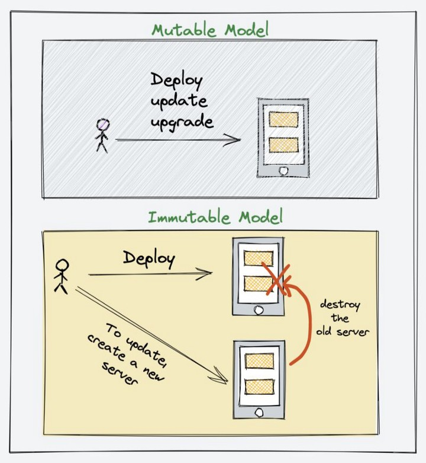

# Infraestrutura Como Código

O IaC, como uma abordagem para definir e gerenciar a infraestrutura por meio de código, se encaixa perfeitamente com os princípios e práticas do DevOps. Ao usar o IaC, os engenheiros de DevOps podem criar e provisionar infraestrutura de maneira automatizada, consistente e reproduzível, permitindo a implantação rápida e confiável de ambientes.

A integração contínua e a entrega contínua (CI/CD) também se beneficiam da combinação de IaC e DevOps. Ao incorporar o IaC nos pipelines de CI/CD, é possível automatizar a criação de ambientes de teste, a implantação de aplicativos e a execução de testes automatizados. Isso acelera a iteração do desenvolvimento, reduzindo o tempo de lançamento de novas funcionalidades.

## On-Premisses (Tradicional) VS IaC (Cloud)

Desvantagens do provisionamento de infraestrutura tradicional on-premises:

- Custo inicial elevado.
- Manutenção complexa.
- Capacidade limitada de escalabilidade.
- Tempo de implementação prolongado.
- Falta de flexibilidade.
- Menor eficiência energética.

Vantagens do uso de IaC na nuvem:

- Custo inicial mais baixo.
- Facilidade de manutenção.
- Escalabilidade sob demanda.
- Implantação rápida.
- Flexibilidade e personalização.
- Maior eficiência energética.

## Vantagens do uso de Infrastructure as Code (IaC):

- *Automatização*: Permite automatizar a criação e configuração da infraestrutura.
- *Reprodutibilidade*: Possibilita reproduzir ambientes consistentemente em diferentes estágios do desenvolvimento.
- *Agilidade*: Acelera a implantação da infraestrutura.
- *Rastreabilidade*: Permite rastrear e auditar alterações na infraestrutura.
- *Colaboração*: Facilita a colaboração entre equipes de desenvolvimento e operações.
- *Consistência* e conformidade: Ajuda a garantir configurações consistentes e conformidade com requisitos.
- *Escalabilidade* e flexibilidade: Facilita a escalabilidade e a modificação da infraestrutura de acordo com as necessidades em mudança.

## Imutabilidade da Infraestrutura

#### DOC DE REFERÊNCIA TERRAFORM

- https://www.hashicorp.com/blog/infrastructure-as-code-in-a-private-or-public-cloud
- https://www.hashicorp.com/resources/what-is-infrastructure-as-code
- https://developer.hashicorp.com/terraform/tutorials/aws-get-started/infrastructure-as-code