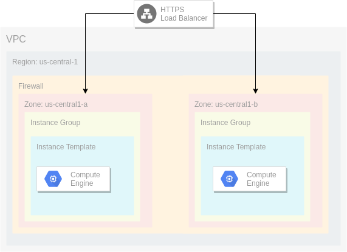
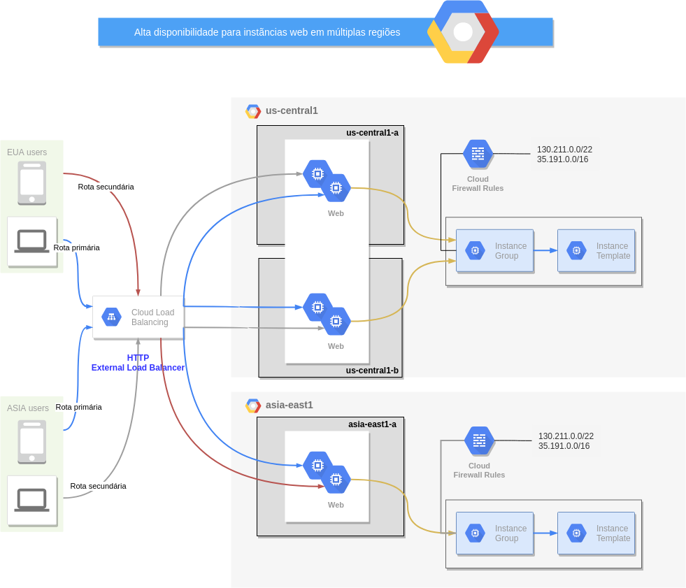

# Project Time

Para criar um ambiente do Google Cloud Platform (GCP) que implementa um balanceador de carga para distribuir o tráfego entre grupos de instâncias do Compute Engine usando o Terraform, você precisaria usar no mínimo seguintes recursos do Terraform:

1. `google_compute_network`: Este recurso representa uma rede de nuvem virtual (VPC) do GCP. Você pode usá-lo para criar a rede onde suas instâncias residirão.

2. `google_compute_firewall`: Este recurso permite criar regras de firewall para controlar o tráfego de rede em suas instâncias do Compute Engine. Ele permite definir regras de firewall para controlar o tráfego de rede entre o load balancer e as instâncias do Compute Engine.

3. `google_compute_instance_template`: Este recurso permite que você defina um modelo para suas instâncias do Compute Engine. Você pode especificar propriedades da instância, como tipo de máquina, disco de inicialização, tags de rede, etc. Esse modelo será usado pelo gerenciador de grupo de instâncias para criar instâncias dentro do grupo gerenciado.

4. `google_compute_region_instance_group_manager`: Este recurso define um gerenciador de grupo de instâncias regional no GCP. Você criará vários gerenciadores de grupo de instâncias para distribuir sua carga de trabalho em diferentes regiões. Cada gerenciador de grupo de instâncias irá gerenciar um grupo de instâncias do Compute Engine que lidará com seu tráfego.

5. `google_compute_health_check`: Este recurso define uma verificação de integridade para o balanceador de carga. Ele permite monitorar a saúde de suas instâncias e remover as instâncias não saudáveis ​​do pool de balanceamento de carga.

6. `google_compute_backend_service`: Este recurso representa um serviço de backend do balanceador de carga no GCP. Você criará um serviço de backend para definir o conjunto de gerenciadores de grupo de instâncias que lidarão com seu tráfego.

7. `google_compute_forwarding_rule`: Este recurso define a regra de encaminhamento para o balanceador de carga. Ele especifica o endereço IP externo e a(s) porta(s) em que ouvirá o tráfego e encaminhará para o pool de destino.

8. `google_compute_target_http_proxy`: Este recurso configura um proxy HTTP para encaminhamento de tráfego HTTP em um balanceador de carga. Ele permite definir as configurações de proxy, como os serviços de back-end associados e os encaminhamentos de tráfego.

9. `google_compute_url_map`: Este recurso é utilizado para mapear URLs para serviços de back-end em um balanceador de carga. Ele define como as solicitações recebidas em um determinado URL devem ser roteadas para os serviços de back-end correspondentes.

Esses são os recursos-chave do Terraform que você precisaria usar para criar um ambiente GCP com um balanceador de carga que distribui o tráfego entre grupos de instâncias do Compute Engine usando o recurso `google_compute_region_instance_group_manager`. Você pode configurar esses recursos de acordo com seus requisitos específicos, como configuração de certificados SSL, afinidade de sessão ou outros recursos avançados de balanceamento de carga oferecidos pelo GCP.

#### DOCS DE REFERÊNCIA

- [Google Compute Network](https://registry.terraform.io/providers/hashicorp/google/latest/docs/resources/compute_network "Google Compute Network")
- [Google Compute Firewall](https://registry.terraform.io/providers/hashicorp/google/latest/docs/resources/compute_firewall "Google Compute Firewall")
- [Google Compute Instance Template](https://registry.terraform.io/providers/hashicorp/google/latest/docs/resources/compute_instance_template "Google Compute Instance Template")
- [Google Compute Region Instance Group Manager](https://registry.terraform.io/providers/hashicorp/google/latest/docs/resources/compute_region_instance_group_manager "Google Compute Region Instance Group Manager")